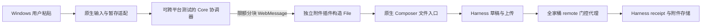

# 全家桶与独立附加插件：远程文件粘贴实施方案

方案版本：2.0。状态：可执行的分轮开发方案；业务代码尚未实施。日期：2026-09-13。

## 1. 唯一目标与交付范围

目标环境为 DeepSeek Harness＋`@linxin666/dsh-web-all` 全家桶＋一个独立附件扩展插件。Windows 客户端继续为本仓库的 DSH Windows Launcher。全家桶内现有远程访问插件是唯一配对、设备凭据、远程代理及隧道提供者，不另装第二份 remote-web-ui，不替换或重新打包全家桶。

用户在资源管理器复制普通文件或复制截图，在当前远程会话编辑器粘贴，获得待发送附件；由用户主动发送。普通文本保持原有行为。完成标准是附件属于正确草稿、上传与消息契约正确、发送后 Harness 的工具实际读取正确内容，而非只显示名称或插入 Windows 路径。

首期支持普通磁盘文件、多文件、截图、错误提示、取消和手动重试。目录递归、UNC、Shell 虚拟文件、云盘占位文件自动下载、自动解压和断点续传不在首期范围。禁止自动发送消息。

导入前提是当前可编辑主会话已经具有有效 sessionId，新建但尚未发送消息的会话同样支持。尚未选择工作区、没有 sessionId 的首页提示用户先建立会话再粘贴，不在后台猜测归属、自动创建会话或跨草稿暂存后自动投递；这类状态不算成功导入。

开发工作及项目开发验证须可在 Linux 完成，不依赖 Windows、Wine、远程 Windows runner 或 Windows 剪贴板。Windows 原生适配代码仍须实现，实际编译/运行与安装验收单独按 [Windows 实机验证方案](windows-validation-plan.md)交接；未完成前不得宣称 Windows 已通过或产物可发布。

配套文件：

- [任务索引与 26 张任务卡](task-index.md)：依赖、改动范围、步骤和逐项验收。
- [分轮执行与恢复规则](execution-workflow.md)：首轮仅 D00，之后每轮最多一个叶任务，结果持久化后停止。
- [机器可读依赖图](task-graph.json)与[执行台账](execution/state.json)：任务定义与动态状态分离；初始全部 todo。

- [非 Windows 开发验证方案](portable-validation-plan.md)：开发阶段的命令契约、分层证据、测试矩阵。
- [Windows 实机验证方案](windows-validation-plan.md)：实机阶段独立执行的编译、UI、剪贴板、网络及安装验收。
- [DeepSeek Harness 实施提示词](deepseek-harness-prompt.md)：将本方案转为代码迭代任务。

## 2. 已验证事实与尚待验证项

Launcher 研究基线为 `df68795c3f7a0a34d6ed4fdd7804e369bdd0258b`。dsh-web 固定研究基线 `0d78d391b5f67ec4d9f04d47558b76352c74ee48`，全家桶和 remote 包均为 0.3.21；Harness 固定研究基线 `c291e7961a515f6d7af9304e7fd1d257929aef26`，版本 0.1.5-rc.2。开始实施时记录实际 package lock、原生 bundle 与解析版本，不用最新 dev 自动替换已验证组合。

| 事实 | 证据与影响 |
| --- | --- |
| 全家桶 host 通过 shell 加载 remote，client 内联子插件 | 附件插件作为额外独立包注册，不能修改聚合子插件清单或再次挂载 remote。[all package](https://github.com/zhu1090093659/dsh-web/blob/0d78d391b5f67ec4d9f04d47558b76352c74ee48/packages/dsh-web-all/package.json)、[client children](https://github.com/zhu1090093659/dsh-web/blob/0d78d391b5f67ec4d9f04d47558b76352c74ee48/packages/dsh-web-all/src/client/children.generated.ts) |
| remote 在 host 的 index-inject 注入启动前脚本 | 附件上传 hook 同样从 host 同步注入，不能等待全家桶异步 client apply。[remote index](https://github.com/zhu1090093659/dsh-web/blob/0d78d391b5f67ec4d9f04d47558b76352c74ee48/packages/dsh-remote-web-ui/src/index.ts#L852-L874) |
| Harness 已有二进制文件上传及 pre-Cordis transport hook | 复用 `POST /api/session/uploadFileBinary`、receipt、图片草稿和既有文件存储，不新建上传服务器。[file-upload runtime](https://github.com/deepseek-ai/deepseek-harness/blob/c291e7961a515f6d7af9304e7fd1d257929aef26/packages/client/file-upload/src/client/runtime.ts) |
| 默认 Blob 上传用 Worker 内 XHR，无法自动被主 window.fetch 改写 | 首期由上传 hook 转交当前页面 fetch，走原 remote 代理；此为源码风险，仍须实际浏览器证实请求链路。 |
| IConversation 不公开 createDrafts，附件 slot 是 single 且已被原生 UI 使用 | 首选验证既有文件选择 input 的受控 DOM 适配；不夺取 single slot，不读取 React/Lexical 私有对象。[InputBar](https://github.com/deepseek-ai/deepseek-harness/blob/c291e7961a515f6d7af9304e7fd1d257929aef26/packages/client/ui-conversation/src/client/skeleton/InputBar.tsx)、[service contract](https://github.com/deepseek-ai/deepseek-harness/blob/c291e7961a515f6d7af9304e7fd1d257929aef26/packages/client/ui-conversation/src/client/service.ts#L39-L70) |
| Launcher 的 TFM/RID 当前全局为 Windows | Core 与测试需解除 Windows 继承，原生适配保持 Windows；不是把原 verify.ps1 在 Linux 跳过多数检查就算通过。 |

源码、Node 探针、Linux Chromium、实际 Harness、Windows WebView2 分别是不同证据层级。不能互相替代。实际部署版本与现场上传结果尚未验证。

## 3. 仓库与模块设计

在当前 Launcher 仓库内加入 `plugins/dsh-remote-attachments/`，作为可独立打包的 npm 插件项目。使用自有 scope，最终名称在发布前确定；不占用原插件 npm 名称或 Cordis row id，不作为全家桶依赖自动加载。第一阶段只生成本地 tarball，不执行 npm 发布。

| 位置 | 拟实现职责 |
| --- | --- |
| `src/DshLauncher.Core/Attachments/` | 粘贴操作协调、上下文绑定、分块顺序/背压/取消、限额和错误模型；纯 net10.0 |
| `src/DshLauncher.Desktop/Attachments/` | STA 剪贴板、原生输入手势、截图 PNG、WebView2 消息接入；不包含可移入 Core 的状态机 |
| `src/DshLauncher.Platform.Windows/Attachments/` | 暂存所有权、Windows 文件属性与重解析点检查、句柄及清理适配 |
| `src/DshLauncher.Desktop/Remote/RemotePageSession.cs` | 从 RemoteWindow 局部提取页面生命周期、可信 origin、导航代际与任务取消；保留现有标签和隔离用户目录 |
| `plugins/dsh-remote-attachments/src/host/` | head 注入、能力配置；不接管配对路由或数据库 |
| `plugins/dsh-remote-attachments/src/client/` | WebView 桥接、File 构造、会话适配、原生附件入口确认、进度/错误视图 |
| `plugins/dsh-remote-attachments/src/shared/` | 协议 schema、限额、兼容声明和纯函数 |
| `schemas/remote-attachments/` | JSON 协议 schema 与 C#/TS 共用黄金样本 |
| `tests/DshLauncher.Core.Tests/Attachments/` | 用可控文件源、时钟和通道验证真实生产协调器 |
| `eng/verify-portable.ps1` | 新增 Linux 开发验证入口；详见专项文档 |

优先维持现有六个 C# 项目数量。Core 和 Core.Tests 显式使用 net10.0、无 win-x64 RID，其他四个项目继续保留原 Windows 定位。新增接口只放在实际系统交互点：候选输入/字节源、消息通道、时钟与上下文检查。不得为测试复制一份生产状态机。

### 3.1 Windows 端的重构范围

Windows 端需要局部重构，主要目的为把可测试业务逻辑从原生 UI 生命周期中分离。保留 WPF、WebView2、现有窗口/标签、配对、凭据隔离和安装架构，不更换 UI 技术栈或重写整个 Launcher。

| 改动 | 对应任务 | 边界与验收 |
| --- | --- | --- |
| 调整 Core/Core.Tests 平台目标 | D01–D02 | 两项目可在 Linux 独立构建和运行；原 Windows 工程与发布身份检查保留 |
| 新增附件生产协调器 | D10–D11 | 协议、背压、取消、限额和上下文绑定均在纯 Core；不依赖 WPF |
| 提取 RemotePageSession | D15 | 集中页面代际、事件注册/解除和取消；现有标签、UDF 与目标隔离行为不变 |
| 编写原生适配及组合 | D14、D16–D17 | 真实剪贴板、暂存、原生手势和 WebView2 接入完整；通过 Linux 可执行边界检查并单独交接实机 |

是否继续拆分 RemoteWindow 之外的模块，应由实际耦合或失败证据决定。当前方案不包含配置、安装器、整个网络栈或全局 MVVM 重写；如果任务边界确实不足，按分轮规则登记单独任务，不能把局部修复扩大为整库重构。

## 4. 首期确定的数据通路

### 4.1 为什么首期固定为分块桥

首期统一采用 256 KiB 原始字节块、最多两块在途、逐块 ACK 的 WebMessage 通路，不让开发依赖 Windows FileSystemHandle 原型选型。需要 JSON 编码时仅对当前块 Base64 编码，禁止把整个文件拼成一个字符串；JS 端组装 Blob/File 的完整内存仍计入预算。FileSystemHandle/getFile 留作后续优化，不作为首期正式分支。

这样可以在 Linux 对同一套 C# 生产协调器、协议样本和浏览器接收器实施测试；不能因此推定 WebView2 原生消息接入已经通过。普通截图优先保留浏览器真实 paste；桥兜底必须在捕获阶段明确唯一消费者，禁止重复添加。

默认建议：20 MiB/文件、10 项/批、50 MiB/批、40 百万像素/截图编码前、100 MiB/目标暂存。全局最多两个目标同时传输，每目标一次只组装一个文件，禁止一批所有文件同时 Base64。图片还须服从 Harness 的 imageLimits。所有数字是可测试的首期配置，不能代表代理或宿主已接受同样大小。

### 4.2 消息与操作身份

协议 version=1。D10 固定字段、整数范围、限额、超时和错误码，并用 C#/TS 生产 codec 互读同一组有效及恶意样本。消息采用 hello/capabilities、context、batch-begin、file-begin、chunk、ack、file-end、import-result、batch-end、cancel；具体枚举写入 schema，不能由两端分别猜测。

一次用户粘贴对应一个 batchId；首期 operationId 与 batchId 使用同一值，不维护两套可漂移身份。每个文件具有独立 fileId，绑定 targetId＋documentEpoch＋composerEpoch＋sessionId＋batchId。文档 epoch 由原生端掌握，composer 身份由插件当前会话 scope 产生并在变化时失效。没有有效 sessionId 不接收批次。

| 消息或结果 | 精确含义 |
| --- | --- |
| batch-begin | 声明文件数量、总字节及当前身份；限额和能力未通过时拒绝整批开始 |
| file-begin | 声明 fileId、叶文件名、字节数、MIME 和可用时的 SHA-256；每目标只处理一个文件 |
| chunk / ack | seq 从每个文件的 0 开始，offset 连续；ACK 仅证明接收缓冲接受，最多两块在途 |
| file-end | 校验该文件累计字节及最终哈希；无误才允许构造 File 并调用一次草稿导入 |
| import-result | 返回该 fileId 的 staged 与新增 attachmentIds，或确定的失败/部分结果；不代表上传 ready |
| batch-end | 汇总各文件结果，结束批次；不能把已经 staged 的文件再次整体导入 |
| cancel | 对指定操作停止后续传输，释放自有资源，拒绝迟到结果；不自动撤销已发送消息或删除远端共享文件 |

每次 file-end 默认向原生入口提交一个 File，因此该次导入 ACK 要求新增 ID 数为 1；测试或兼容 adapter 接受多项时，按实际调用项数比较。按 fileId 记录成功、失败和待处理状态，不能只保存一个批次布尔值。取消或部分失败保留可确认的成功草稿，并向用户说明失败项；用户明确重新导入失败项时生成新的 batchId/fileId，不重导入已成功项。上传阶段的重试则复用原 Harness draft。

重复 chunk、file-end 和 batch-end 不产生第二次导入。缓存键至少包含 documentEpoch、composerEpoch、batchId 和 fileId，并设置容量与生命周期；活动操作不可因缓存淘汰而重新执行。过期身份在进入缓冲前拒绝；批次关闭后新批次必须经 batch-begin 承认，不能凭一个迟到 file-end 重新建立操作。导航/关闭清理缓存并提升 epoch。

HTTP LAN 不能依赖 SecureContext 专属 API：Web Crypto 不可用时，使用锁定依赖的纯 JS 增量 SHA-256；不得关闭内容完整性验证。错误分为原生采集、协议传输、草稿导入、远端上传四阶段，不提供网页请求任意本机路径的接口。

### 4.3 配对与上传 hook

附加插件的 host 半区通过 `webserver/index-inject` 安装 `__DSH_FILE_UPLOAD__`。仅在已验证远程模式使用，不依赖全家桶 client 的加载先后；全家桶 remote 被禁用或降级时停止附件能力。

上传 hook 在调用时读取当前 `window.fetch`，传入原始同源 `/api/session/uploadFileBinary`、有效 `Headers`、body 与 signal。由原 remote 进行一次 `/remote/api/...` 改写和免 Cookie 设备头注入；不要提前捕获裸 fetch，不自行再加 `/remote`。通道身份、就绪标记及改写行为由固定版本适配验证，不把任意全局布尔值当认证结果；最终授权仍由远端 `/remote` 验证。

已有别的 `__DSH_FILE_UPLOAD__` 时只接受明确支持的组合，否则报 capability conflict 并保留原功能；不覆盖未知 hook。上传失败可能为 HTTP 200 的 `{ok:false,error}`，交给上游 envelope 解析。remote 拒绝可能是 403，心跳为 401，分别解析而非仅判断统一状态码。

自定义承载没有上游字节进度回调时显示不确定的“上传中”，不伪造百分比。热禁用时停止接收新任务并取消在途请求；FileUploadRuntime 已捕获的 closure 不能靠恢复全局变量重新选择，必要时明确要求页面重载。配对与心跳不得随附件禁用被关闭。

### 4.4 会话草稿接入：首个 Linux 闸门

首选版本适配器沿用原生隐藏文件选择控件：在会话 scope 的非排他 overlay 插入无视觉影响的锚点，从该锚点定位所属 `[data-composer-card]`，确认其中唯一 `input[type=file][multiple]`。File 组装完成后使用 DataTransfer 设置该 input 的 files，并触发一次 change，进入原 `onPickFiles → intakeFiles → addFiles` 链路，保留图片校验和原附件 UI。

这属于有版本约束的 DOM 适配，不是 Harness 稳定 API。以下条件必须在 Linux Chromium＋真实 Harness＋全家桶中全部成立：可获得正确 session/draft 身份；唯一输入控件属于该身份且可接收；原输入状态中出现新增附件 ID；图片和普通文件均走原校验；切会话迟到结果不会进入新草稿。不能以 dispatchEvent 返回值、文件名卡片或一个选择器命中视为导入 ACK。

固定版本的候选接入点为注册 overlay 时取得 sessionId，通过 `ctx.sessions.scope(sessionId)` 和 `ctx.conversation.input.for(scope).state` 的 `getSnapshot()/subscribe` 读取原生 input 状态，比较导入前后的 attachmentIds。实施时核对公开类型与 scope 释放要求，不能只做类型强转绕过不存在的方法。必须额外校验 phase、blocks、可编辑状态和子代理限制；hidden input.disabled 本身不足以表达完整 gate。若无法建立可靠归属确认，该适配器不得进入正式支持矩阵。不得抢占 `conversation.input.attachments` single slot、替换原附件 UI、通过 React fiber 取回调或向 document 广播合成 drop。

导入及 ACK 在同一同步任务中比较状态：旧 IDs 完整保留，新增 IDs 数等于本次导入调用的文件数且上下文未变；正式桥逐文件调用时该数量为 1。建立 batchId/fileId 与新增 attachmentIds 的映射，批量适配测试另保持调用内文件顺序。后续 subscribe 只用于这些 ID 的状态变化，不把别的文件选择产生的异步附件误认作本批。数量或映射不符时返回明确失败/部分导入状态，保留可确认的原生结果，不自动再派发 change。

若首选入口无法满足归属与 ACK：在 Linux 原型中验证版本化公共导入扩展点的最小补丁，并把它列为明确外部依赖。后续执行轮仅推进当前图中已经就绪的独立任务；若需提前推进分块或原生薄适配，先登记与该风险无关的子任务并显式调整依赖，正式桥组合与目标基线支持仍等待 D09。最终不能只返回 Unsupported 就宣称支持目标基线。若确需 Harness 核心改动，记录最小补丁与原因，保留用户“尽量不改核心”的边界，不转向全量重写。

## 5. 用户动作、资源与失败语义

原生端只在窗口可见、目标标签活动、WebView 获得焦点且有原生粘贴手势时读取 CF_HDROP/图像。页面的 `isTrusted` 字段、路径或文件名不能代替该手势。纯文本及未识别格式保留原行为；识别文件且桥不可用时明确提示，不静默插入本机路径。

每个已验证页面在能力握手时确定截图输入所有者：native-paste 或 bridge。只有位图的粘贴按该模式处理；同时具有 CF_HDROP 与位图时优先文件列表。当前动作一旦交给原生 paste，就不能因超时或尚未看到草稿而补发桥导入；切换模式只影响后续用户动作。bridge 模式必须在原生输入路由中抑制该次默认图片粘贴。兼容矩阵和 Windows 专项分别证明每种模式的唯一消费，不能只靠事后去重。

从用户选择的普通文件制作受控暂存快照；复制期间源变化、删除、占用或磁盘不足分别失败。STA 线程只做必要剪贴板访问，复制与字节传输异步。暂存只清理应用拥有目录，拒绝重解析点绕过，不自动下载云文件或读取网络共享。

页面导航、关闭、切换会话、配对撤销使相应操作失效，丢弃迟到导入。隐藏窗口后禁止新操作，已授权任务可继续绑定原草稿；若无法证明身份仍存在则取消。移除目标或退出应用必须取消并释放资源。

普通上传 error 使用 Harness 既有 retryFileUpload 复用原 draft 重试。已上传 receipt 绑定 Session，宿主重启后旧 ready receipt 可能失效；此时提示用户移除失效草稿后重新导入，不自动重发消息。移除草稿不删除 Harness 共享内容寻址对象；只清理本功能自有暂存。撤销后拒绝下一请求不等同于立即中断在途上传，测试需分别断言；未验证宿主主动中断能力时不得作此承诺。

日志仅记录脱敏操作标识、阶段、字节数、耗时与错误码，不含设备凭据、URL 查询秘密、文件内容或完整本机路径。小型状态机负责去重与取消，上传 ready/error 与发送由 Harness 管理。

## 6. 分轮任务与交付条件

实施以 [26 项任务及独立任务卡](task-index.md)为准。每张卡给出前置依赖、可修改范围、步骤、交付、验收与停止条件。不得只读阶段表就把整组阶段放在一轮内执行。

| 阶段 | 任务 | 交付条件 |
| --- | --- | --- |
| 基线与可移植基础 | D00–D02 | 首轮 D00 只核实基线和建立台账；后续分别完成 Core 目标拆分和增量门禁 |
| 最小真实闭环 | D03–D09 | 依次具备独立插件骨架、真实 Harness/all 夹具、配对、模型读取夹具、上传 hook 和草稿入口，D09 才组合验证 |
| 协议和插件组合 | D10–D13 | 明确批次/文件契约，完成真实生产 Core、接收器及插件能力桥 |
| Windows 局部接入 | D14–D17 | 完整编写文件暂存、页面生命周期、原生粘贴和 WebView2 组合，Linux 验证可移植边界；实机另验 |
| 生产互通与故障 | D18–D21 | 真实 C#↔Chromium↔Harness 互通、网络故障、会话/来源隔离及资源上界 |
| 安装、兼容和开发交接 | D22–D25 | 最终 tarball 干净安装、停用/更新后状态、完整 Linux 门禁与 Windows 交接 |

D01–D02 与最小插件组件有独立依赖，但仍遵守一轮一个任务。D09 是大规模客户端接入前的技术闸门，不能靠后续代码量掩盖草稿入口失败。若 DOM 适配确实不成立，先登记兼容缺口或最小公开扩展点补丁；可以在之后的执行轮推进不依赖该缺口的任务，但目标基线支持仍不能算完成。

D18 必须调用真实 C# 生产协调器，经测试通道进入 Chromium 中的生产接收器，再进入真实 Harness，双向 ACK 回到同一 Core；只替代 WebView2 的物理消息边界。优先在现有 Core.Tests 通过 Node 子进程驱动，记录 Node/Chromium 与服务夹具依赖，不另造 JS sender 冒充 C#。若确需辅助项目，先登记工程/门禁变更。

分轮规则、状态机与恢复模板见 [执行规则](execution-workflow.md)。每轮结束保存 state.json、轮次记录和 handoff；完成一个任务后停止，不自动接下一任务。开发任务不依赖 W 轨道，不要求 Windows 在线；最终 Linux 报告与 Windows 待验状态并列。

在 D09 取得真实闭环证据后，再用各任务实际执行耗时修正工作量估计。26 是初始任务数，复杂任务可以分多轮，不承诺固定 26 轮完成。局部变更保持可审查、可回退；本方案不授权自动推送、发布或修改生产 profile。

## 7. 完成状态与回退

- `DevelopmentReady`：全部 DEV 叶任务完成且证据有效，D24 的完整 Linux 门禁真实通过，D25 的源码、tarball 和实机交接完整；不需要 Windows 在线。
- `WindowsPending`：Windows 构建或实机未执行；可以交接代码，不能发布正式版本。
- `ReleaseReady`：Windows 专项和原正式发布门禁全部通过；发布动作仍按独立授权执行。

关闭附加插件只停止附件能力，保留全家桶配对、心跳和设备库。页面 hook 需要重载时明确提示。安装包回退遵循现有禁止降级规则，可用功能开关或修复版本；不恢复会复活已吊销设备的旧凭据快照。

## 8. 证据边界与方案校验

先前研究已核对静态源码、项目构建属性，并在当前 Windows 主机 Node v24.19.0 运行 [上传脚本探针](probes/probe-remote-upload-boot.mjs)，7 个用例通过。脚本没有 Windows API，但该次运行不是 Linux 验证，也没有网络、浏览器或真实 Harness。重跑方式见 [探针说明](probes/README.md)。

本次 2.0 修订增加任务图、任务卡、分轮台账和提示词，校验文档链接及依赖一致性。未实施业务代码，未执行本方案的 Linux 完整宿主端到端或 Windows 实机验证，也未修改生产配置。方案中的新脚本、插件目录和协议均为待实施契约，不代表现有工具已运行成功。初始任务台账全部为 todo。
