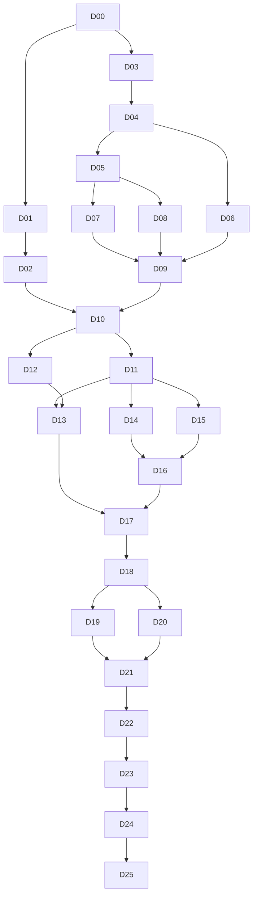

# 开发任务索引

方案版本：2.0。部署环境固定为 Harness＋全家桶＋独立附件插件。任务定义见 [依赖图](task-graph.json)，动态状态见 [执行台账](execution/state.json)，调度和恢复规则见 [分轮执行规则](execution-workflow.md)。

共 26 个初始 DEV 叶任务。默认首轮 R00 仅 D00，随后每条明确的“继续”最多执行一个任务；复杂任务可继续多轮或先拆分，因此 26 是初始任务数，不是保证完成的轮数或工期。Windows 实机验证另行安排，不计入开发前置依赖。

## 1. 任务清单

每张任务卡均包含目标、允许改动范围、步骤、交付、验收、停止条件与证据要求。以下验收摘要不能替代任务卡及专项矩阵。

| 任务 | 必须先完成 | 验收摘要 |
| --- | --- | --- |
| [D00 核实基线并建立执行台账](tasks/d00-baseline.md) | 无 | 本轮没有业务代码、生产 profile、安装包或远端发布变化。 |
| [D01 分离 Core 的平台目标](tasks/d01-portable-core.md) | D00 | Core/Core.Tests 最终 TFM=net10.0、RID为空，生产 Core 不增加平台依赖。 |
| [D02 建立可增量扩展的 Linux 开发门禁](tasks/d02-portable-gate.md) | D01 | Core 格式/构建/实际测试可重复通过。 |
| [D03 建立独立附加插件骨架与最小包](tasks/d03-addon-scaffold.md) | D00 | tarball 含运行入口和必要资源，不含凭据/生产数据。 |
| [D04 启动隔离的真实 Harness 与全家桶夹具](tasks/d04-bundle-fixture.md) | D03 | remote 和 addon 的 host/client 各按预期挂载，未额外安装 remote。 |
| [D05 验证测试配对与远程通道](tasks/d05-pairing-fixture.md) | D04 | 实际请求走 /remote；无有效设备的请求不能读取工作区。 |
| [D06 建立确定性模型与真实工具读取夹具](tasks/d06-provider-fixture.md) | D04 | 工具结果由真实 Harness 工具产生，不是 stub 伪造。 |
| [D07 实现并验证启动前上传承载](tasks/d07-upload-hook.md) | D03、D05 | 实际 URL只改写一次，设备头存在且不跨源泄露。 |
| [D08 实现原生草稿入口及同步导入确认](tasks/d08-draft-adapter.md) | D03、D05 | 新增附件ID确定属于当前操作，无自动发送、无document广播drop。 |
| [D09 完成 Linux 最小附件发送闭环](tasks/d09-minimal-loop.md) | D06、D07、D08 | 草稿、网络、receipt、工具字节四层证据一致。 |
| [D10 冻结批次与文件协议并实现双端 codec](tasks/d10-wire-contract.md) | D02、D09 | 整数边界、编码、大小写、重复end和跨文件消息行为一致。 |
| [D11 实现可移植分块协调器](tasks/d11-core-transfer.md) | D01、D10 | Linux直接运行该Core；所有待确认字节、队列、缓存都有上界。 |
| [D12 实现浏览器分块接收与文件构造](tasks/d12-browser-receiver.md) | D03、D10 | File名称/长度/内容正确，坏哈希不能导入。 |
| [D13 组合附加插件桥与能力状态](tasks/d13-addon-bridge.md) | D07、D08、D11、D12 | 全家桶remote降级或禁用时附件能力明确不可用，原配对不被关闭。 |
| [D14 编写 Windows 文件快照与暂存适配](tasks/d14-windows-staging.md) | D11 | 没有任意远端路径读取入口；失败清理不会触及应用目录外。 |
| [D15 局部提取远程页面生命周期](tasks/d15-page-session.md) | D11 | 不改配对协议/用户目录隔离，旧页面迟到消息失效。 |
| [D16 实现原生粘贴手势与剪贴板适配](tasks/d16-native-paste.md) | D14、D15 | 不信任页面isTrusted字段或路径；耗时复制不阻塞STA。 |
| [D17 完成 WebView2 与生产 Core 组合](tasks/d17-webview-composition.md) | D13、D16 | 没有TODO/mock在生产路径代替Clipboard/WebView；Core与JS使用同协议。 |
| [D18 验证真实 C# 与浏览器生产接收器互通](tasks/d18-production-interop.md) | D17 | 不仅是黄金样本或JS模拟sender；哈希、批次/文件ID和草稿ID正确。 |
| [D19 验证上传网络错误与撤销语义](tasks/d19-network-failures.md) | D18 | 错误可见、数据不乱投、消息不自动重发；不同拒绝语义被正确记录。 |
| [D20 验证会话与来源隔离](tasks/d20-isolation.md) | D18 | 所有错投计数为零；拒绝不泄露本机路径/字节。 |
| [D21 验证背压与资源清理边界](tasks/d21-resources.md) | D19、D20 | 不靠无限队列追求速度；连续操作后保留资源无单调无界增长。 |
| [D22 验证最终 tarball 的干净安装](tasks/d22-package-install.md) | D21 | 没有额外remote实例，包内不含凭据/测试私密数据。 |
| [D23 验证兼容、停用与更新后状态](tasks/d23-compatibility.md) | D22 | 不只恢复global变量便宣称runtime恢复；必要时明确ReloadRequired。 |
| [D24 收敛完整 Linux 开发验证](tasks/d24-development-gate.md) | D02、D19、D20、D21、D22、D23 | 所有必需开发项真实通过，零用例/跳过/notRun均失败。 |
| [D25 冻结开发交付并移交 Windows 实机验证](tasks/d25-handoff.md) | D24 | 不存在未完成业务代码或被误记通过的Windows项。 |

## 2. 里程碑

| 里程碑 | 任务 | 能说明的结果 |
| --- | --- | --- |
| M0 可恢复执行 | D00 | 基线和台账存在；尚未实现功能 |
| M1 可移植基础 | D01–D02 | Core 在 Linux 构建/测试；完整功能门禁仍未完成 |
| M2 最小真实闭环 | D03–D09 | 薄插件、真实全家桶、配对、上传、草稿及主动发送已经连通 |
| M3 双端生产协议 | D10–D13 | 双端 codec、生产 Core、浏览器接收和插件组合具备行为证据 |
| M4 Windows 代码接入 | D14–D17 | 原生适配与组合代码完整；实机证据仍待验证 |
| M5 跨语言及故障验证 | D18–D21 | 真实 C#→浏览器→Harness 互通、故障、隔离与资源证据 |
| M6 可交接开发成果 | D22–D25 | 实际 tarball、兼容回退、完整 Linux 门禁和 Windows 交接齐备 |

M2 通过之前不把 DOM 导入入口和启动 hook 当作已解决前提。先实现最小验证所需部件，再验证闭环，避免把完整功能要求放在实现任务之前。M4 不等待 Windows 在线，但原生代码不能以空实现交付。各任务逐步把已完成检查接入门禁，D24 只收敛最终完整结果，不首次搭建所有测试。

## 3. 依赖路径

图展示主要路径，完整直接依赖以 task-graph.json 为准。路径可以存在并行关系，但受每轮一个任务约束，不在同一轮同时开发不同任务。

## 4. 开始方式

将整个 docs/remote-file-paste/ 目录放入 Launcher 仓库，再把 [完整提示词](deepseek-harness-prompt.md) 中分隔线后的正文交给 DeepSeek Harness。先收到 D00 结果，再通过“继续”推进。只发送技术方案而不发送执行规则，不能确保执行器遵守分轮约束。

